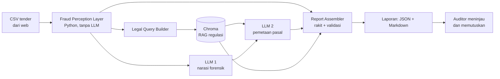

# Sidik Tender

**AI forensik untuk mendeteksi dini persekongkolan tender pengadaan pemerintah (LPSE).**

Sidik Tender membantu auditor APIP/Inspektorat dan pokja pemilihan memprioritaskan paket tender yang berisiko. Sistem menghitung indikator persekongkolan secara deterministik (tanpa LLM), lalu AI agent di IBM Langflow memetakan temuan ke pasal regulasi dan menyusun draf laporan. Keputusan akhir tetap di tangan auditor.

> **Catatan penting:** keluaran sistem adalah *indikator risiko untuk investigasi awal*, bukan bukti pelanggaran. Sistem saat ini diuji pada data simulasi, sehingga belum ada klaim akurasi di dunia nyata (lihat [Keterbatasan](#keterbatasan)).

## Masalah yang Diselesaikan

Pemeriksaan tender umumnya manual dan berbasis sampel. Jejak kartel tersebar lintas paket: penawaran bergerombol dekat HPS, peserta dengan pengurus atau alamat yang sama, pengiriman dokumen hampir bersamaan, dan pemenang yang bergilir. Sidik Tender menghubungkan jejak itu, memberi skor yang dapat dijelaskan, dan menyiapkan draf laporan beserta rujukan regulasi.

## Cara Kerja



**Lapisan 1: deterministik (`fraud_detection.py`)**
- Sinyal harga: sebaran penawaran (CV), kedekatan ke HPS.
- Sinyal waktu pengiriman (dinonaktifkan jika peserta < 3).
- Graf relasi antar-perusahaan (NPWP, direktur, alamat, subnet IP) dengan bobot per jenis relasi. Nama direktur dan alamat dinormalisasi.
- Co-bidding berulang dan rotasi pemenang antar paket.
- **Aturan override:** bukti keras (direktur/NPWP sama) menaikkan status risiko minimal ke WASPADA, dan ke BAHAYA jika mayoritas peserta dikendalikan pihak yang sama, agar tidak terencerkan rata-rata skor.
- Status: `AMAN` (< 30), `WASPADA` (30-49), `BAHAYA` (>= 50).

**Lapisan 2: AI agent (IBM Langflow)**
- RAG atas regulasi pengadaan (Chroma).
- Dua agent LLM: narasi forensik dan pemetaan temuan ke pasal. LLM tidak menghitung angka.
- **Report Assembler** merakit JSON laporan dari data Python dan memvalidasi keluaran LLM: pasal harus ada di konteks RAG, serta angka, status, dan nama perusahaan harus cocok dengan data.

## Struktur Repositori

```
.
├── fraud_detection.py            # Fase 1: skor, graf, override, report assembler
├── test_fraud_detection.py       # 12 unit test (pytest)
├── langflow/
│   ├── Audit_Sidik_Tender_v2.json
│   └── components/               # kode 3 custom component Langflow
│       ├── fraud_perception_component.py
│       ├── legal_query_builder.py
│       └── report_assembler.py
├── web/                          # antarmuka Next.js (upload CSV + visualisasi)
└── docs/screenshots/
```

## Menjalankan

### Prasyarat
- Python 3.10+ dan Node.js 18+
- Kunci API untuk model bahasa dan embedding yang dipakai flow (saat ini Google Gemini)

### 1. Backend (Python + Langflow)

```bash
pip install langflow networkx pytest chromadb
pytest -q                                   # memastikan modul berjalan

export SIDIK_TENDER_MODULE_DIR=/path/ke/folder/fraud_detection.py
langflow run
```

Di Langflow:
1. Impor `langflow/Audit_Sidik_Tender_v2.json`.
2. Isi API key model di node LLM dan embedding.
3. Atur `Persist Directory` di semua node Chroma ke folder yang sama dan bisa ditulis (disarankan path tanpa spasi), lalu jalankan jalur ingest (File → Split Text → Embeddings → Chroma) **satu kali** dengan dokumen regulasi.
4. Pastikan node **Report Assembler** tersambung: Fraud Perception → `Fraud Data`, LLM 2 → `Legal Narrative`, Parser Chroma → `Regulation Context`, dan outputnya ke Chat Output.

Opsional: `SIDIK_TENDER_ALLOWED_DIR` membatasi path CSV yang boleh dibaca komponen.

### 2. Web (Next.js)

```bash
cd web
npm install
```

Buat `web/.env.local`:

```
NEXT_PUBLIC_LANGFLOW_URL=http://localhost:7860
NEXT_PUBLIC_LANGFLOW_FLOW_ID=<ID flow, lihat tombol API di Langflow>
```

Di fungsi `runAudit`, kunci `tweaks` harus berupa **ID node Fraud Perception Layer** pada flow Anda (lihat tab *Tweaks* di panel API Langflow). Lalu:

```bash
npm run dev
```

Buka `http://localhost:3000`, unggah CSV, dan jalankan audit.

> Jangan menyimpan API key di variabel `NEXT_PUBLIC_*` pada deployment publik, karena nilainya ikut terkirim ke browser. Untuk produksi, panggil Langflow dari route server. Jangan commit `.env.local`.

## Format CSV

| Kolom | Status |
|---|---|
| `package_id`, `package_name`, `hps`, `company_id`, `bid_price` | wajib |
| `company_name`, `category`, `opd` | disarankan |
| `npwp`, `director_name`, `office_address`, `submit_ip`, `submit_timestamp` | opsional, dipakai untuk graf relasi dan sinyal waktu |
| `is_winner` | opsional, untuk deteksi rotasi pemenang |

Jika `is_winner` tidak ada, pemenang diinferensi dari penawaran terendah dan ditandai di `data_quality_notes`.

## Contoh Keluaran (data simulasi)

```json
{
  "status_kesimpulan": "BAHAYA",
  "skor_risiko_persentase": 50,
  "jumlah_vendor_terafiliasi": 2,
  "indikator_ditemukan": ["direktur/pengurus sama"],
  "daftar_vendor": [
    { "nama": "PT A", "status": "MENCURIGAKAN", "alasan": "direktur/pengurus sama dengan PT B" }
  ]
}
```

Diikuti narasi Markdown berisi pemetaan hukum dan, bila ada, bagian *Catatan Validasi Otomatis*.

## Teknologi

IBM Langflow · Python (networkx) · Chroma · Next.js, TypeScript, Tailwind, Recharts · antarmuka web dibangun dengan bantuan IBM Bob.

## Keterbatasan

- Ambang batas dan bobot di `CONFIG` adalah **asumsi awal** dan belum dikalibrasi pada kasus nyata.
- Validasi saat ini memakai data simulasi (ground truth dari generator sendiri), sehingga metrik precision/recall hanyalah uji konsistensi, bukan akurasi dunia nyata.
- Validasi pasal berbasis nomor pasal; nomor yang sama dari peraturan berbeda masih dapat lolos.
- Sinyal waktu dapat menghasilkan false positive karena peserta jujur pun sering mengirim mendekati batas waktu.

## Rencana Pengembangan

- Kalibrasi ambang dengan kasus nyata (misalnya putusan KPPU) dan pengujian pada data tender terbuka.
- Aksi lanjutan lewat watsonx Orchestrate (berkas kasus, draf surat ke Inspektorat) setelah persetujuan auditor.
- Penggantian model ke IBM Granite (watsonx.ai).
- Monitoring tender baru secara berkelanjutan.
